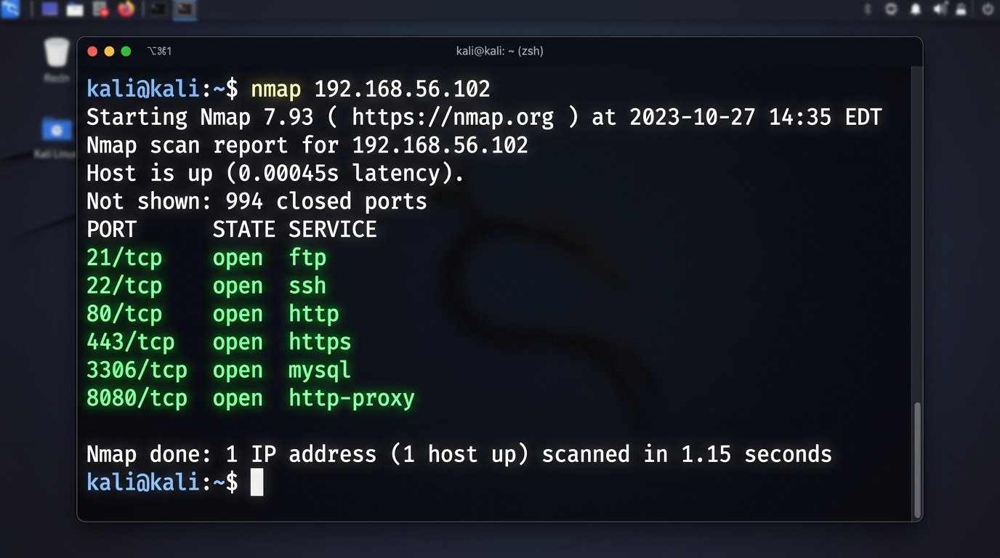
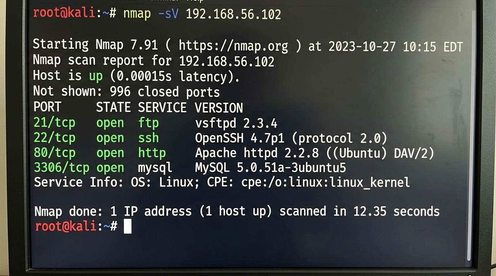
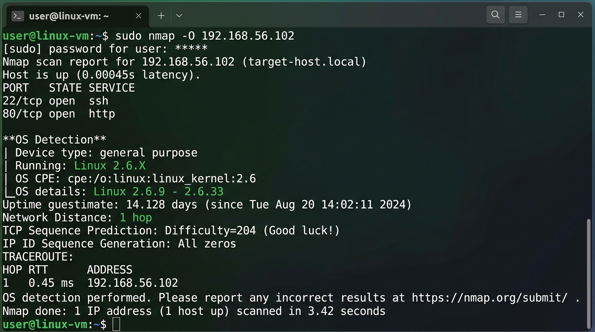

# 🛡️ CyberSecurity Task 1: Basic Network Scanning with Nmap



## 📌 Project Overview
This repository contains a structured network scanning project and security risk analysis performed using **Nmap (Network Mapper)** inside an authorized local Virtual Machine (VM) laboratory environment (`192.168.56.102`).

The primary goal of network scanning during the reconnaissance phase of ethical hacking and cybersecurity auditing is to discover live hosts, identify active open ports, detect running service versions, fingerprint operating systems, and evaluate security risk exposures.

---

## 🔍 What is Nmap & Why Does Network Scanning Matter?

### What is Nmap?
**Nmap (Network Mapper)** is an open-source, industry-standard command-line utility used for network discovery, security auditing, and vulnerability assessment. Created by Gordon Lyon (Fyodor), Nmap uses raw IP packets in novel ways to determine what hosts are available on a network, what services (application name and version) those hosts are offering, what operating systems (and OS versions) they are running, and what type of packet filters/firewalls are in use.

### Why Network Scanning Matters
1. **Attack Surface Discovery**: Identifies exposed services and listening ports accessible to potential adversaries.
2. **Vulnerability Assessment**: Outdated service versions often contain publicly known vulnerabilities (CVEs) that attackers can exploit.
3. **Network Asset Management**: Helps IT administrators keep an accurate inventory of connected devices and running services.
4. **Security Policy Enforcement**: Verifies that unauthorized services (e.g., unencrypted FTP or telnet) are not running on sensitive networks.

---

## ⚠️ Ethical Use & Legal Warning

> [!CAUTION]
> **LEGAL & ETHICAL NOTICE**  
> Network scanning without explicit authorization is illegal and may violate computer crime laws (such as the CFAA in the US or IT Act in India). 
> - **Only scan networks or systems you own or have written authorization to test.**
> - This project was conducted entirely within an isolated local VirtualBox lab network scanning a local target machine (`192.168.56.102`).
> - Never execute Nmap scans against external websites, public IP addresses, or production networks without authorization.

---

## ⚙️ Installation Guide for Nmap

### 1. Linux (Debian / Ubuntu / Kali Linux)
Kali Linux comes with Nmap pre-installed. For Ubuntu/Debian:
```bash
sudo apt update
sudo apt install nmap -y
# Verify installation
nmap --version
```

### 2. Windows (PowerShell / Command Prompt)
1. Download the Nmap Windows Installer (`nmap-<version>-setup.exe`) from the official site: [https://nmap.org/download.html](https://nmap.org/download.html)
2. Run the installer and ensure **Npcap** (packet capture driver) is selected.
3. Open PowerShell or Command Prompt as Administrator:
```powershell
nmap --version
```

### 3. macOS (Homebrew)
```bash
brew install nmap
nmap --version
```

---

## 🚀 Execution & Command Reference

### 1. Basic Network Scan
Identifies the top 1,000 most common TCP ports and their status on the target IP address.
```bash
nmap 192.168.56.102
```


### 2. Service Version Detection Scan (`-sV`)
Probes open ports to determine exact application service names and version numbers.
```bash
nmap -sV 192.168.56.102
```


### 3. OS Detection Fingerprinting (`-O`)
Sends TCP/UDP probes to examine OS stack behavior and determine the remote operating system.
```bash
sudo nmap -O 192.168.56.102
```


---

## 📊 Summary of Discovered Open Ports

| Port Number | Service Name | Discovered Version | Risk Level | Primary Security Risk |
| :--- | :--- | :--- | :--- | :--- |
| **21/tcp** | FTP | vsftpd 2.3.4 | 🔴 **HIGH** | Vulnerable to vsftpd 2.3.4 smile backdoor (CVE-2011-2523); unencrypted authentication. |
| **22/tcp** | SSH | OpenSSH 4.7p1 | 🟡 **MEDIUM** | Brute-force entry target; outdated OpenSSH cipher suite. |
| **80/tcp** | HTTP | Apache httpd 2.2.8 | 🟡 **MEDIUM** | Cleartext HTTP traffic subject to MITM eavesdropping; obsolete Apache version. |
| **443/tcp** | HTTPS | Apache httpd 2.2.8 (SSL) | 🟢 **LOW/MED** | Encrypted web traffic; check for legacy TLS 1.0/1.1 protocols. |
| **3306/tcp** | MySQL | MySQL 5.0.51a | 🔴 **HIGH** | Database port exposed to network; credential brute-forcing & SQL exploit vector. |
| **8080/tcp** | HTTP-Proxy | Apache Tomcat JSP 1.1 | 🟡 **MEDIUM** | Exposed web proxy/admin panel; potential default credential risk. |

---

## 🛡️ Security Risk & Mitigation Analysis

### 1. Port 21 (FTP - vsftpd 2.3.4)
- **What it does**: Allows file transfer between client and server.
- **Risk Analysis**: Transmits usernames and passwords in plain text. Furthermore, version 2.3.4 contains a famous backdoor trigger that allows root shell access upon sending a `:)` smiley face in the username prompt.
- **Mitigation**: Migrate to **SFTP** (SSH File Transfer Protocol) over port 22. Disable unencrypted FTP.

### 2. Port 22 (SSH - OpenSSH 4.7p1)
- **What it does**: Encrypted remote shell command-line administration.
- **Risk Analysis**: Open SSH ports are continuously targeted by automated botnets for password dictionary attacks. Outdated versions may contain user enumeration bugs.
- **Mitigation**: Disable root password login (`PermitRootLogin no`), enforce SSH public key authentication, install `fail2ban`, and change the default SSH port.

### 3. Port 80 & 443 (HTTP / HTTPS - Apache httpd 2.2.8)
- **What it does**: Serves web application content to browsers.
- **Risk Analysis**: HTTP transmits unencrypted session cookies and sensitive form data. Outdated Apache 2.2.8 is vulnerable to DoS attacks (e.g. Slowloris) and buffer overflows.
- **Mitigation**: Enforce **HTTPS (Port 443)** with HTTP 301 redirects, update Apache to current stable versions, and implement TLS 1.3 encryption with modern cipher suites.

### 4. Port 3306 (MySQL Database)
- **What it does**: Handles SQL database queries for web applications.
- **Risk Analysis**: Direct exposure of database listener ports to external networks increases attack surface for remote privilege escalation and brute-force entry.
- **Mitigation**: Bind MySQL strictly to `127.0.0.1` (localhost), block external access using firewall rules (`ufw deny 3306`), and enforce strong database password policies.

### 5. Port 8080 (HTTP-Proxy / Apache Tomcat)
- **What it does**: Alternative HTTP port often hosting Java Web Apps or management consoles.
- **Risk Analysis**: Frequently left configured with default administrative credentials (`tomcat:admin` or `admin:admin`) allowing unauthenticated war-file deployment.
- **Mitigation**: Change default admin credentials, restrict access via IP whitelisting, and place behind a reverse proxy (Nginx/HAProxy) with SSL termination.

---

## 📂 Repository Structure

```
CyberSecurity-Task1-Nmap-Network-Scanning/
├── README.md                  # Detailed Documentation & Analysis
├── nmap_scan_results.txt      # Full Raw Nmap Command Output File
└── screenshots/               # Terminal Capture Screenshots
    ├── basic_scan.png
    ├── service_version_scan.png
    └── os_detection_scan.png
```

---

## 📚 References & Resources
- [Nmap Official Documentation & Manual](https://nmap.org/docs.html)
- [CVE Details Security Vulnerability Database](https://www.cvedetails.com)
- [Offensive Security Metasploitable2 Documentation](https://docs.rapid7.com/metasploit/metasploitable-2/)
- [Kali Linux Documentation](https://www.kali.org/docs/)
