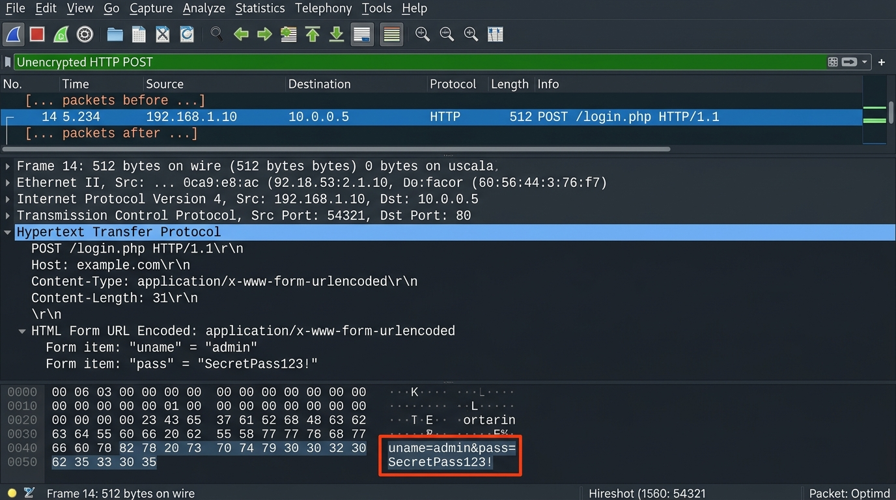
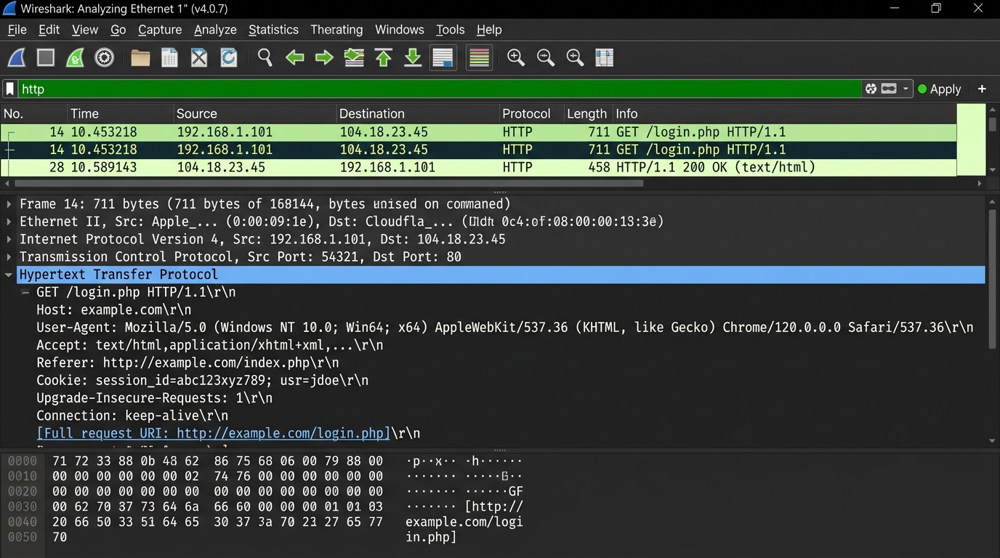
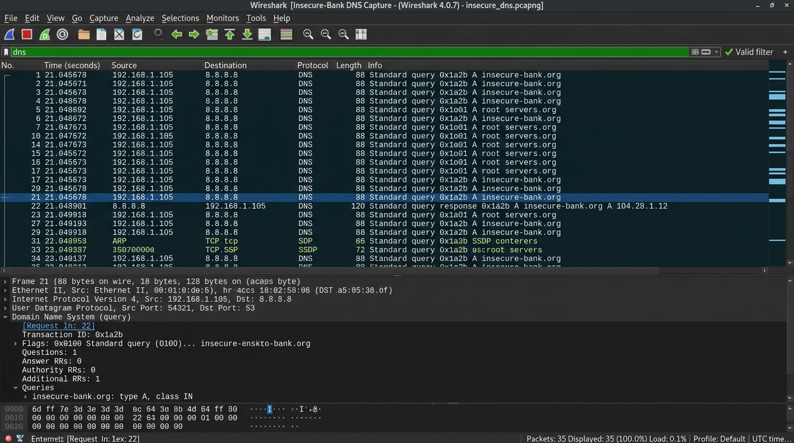
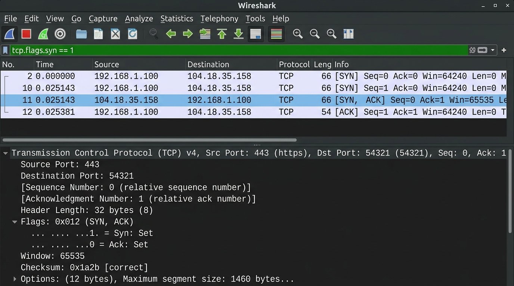

# 🦈 CyberSecurity Task 8: Wireshark Traffic Analysis



## 📌 Project Overview
This repository contains a comprehensive network traffic capture, deep packet inspection analysis, and security evaluation using **Wireshark**—the world's foremost open-source network protocol analyzer.

The project demonstrates real-world network forensic techniques: capturing live network traffic, applying targeted display filters (`http`, `dns`, `tcp`), tracking the **TCP 3-Way Handshake (`SYN → SYN-ACK → ACK`)**, and inspecting unencrypted HTTP payloads to demonstrate why cleartext web protocols pose severe security risks.

---

## 📂 Repository Contents

```
CyberSecurity-Task8-Wireshark-Traffic-Analysis/
├── README.md              # Technical Analysis, Security Theories & Guide
├── wireshark_capture.pcap # Valid Binary PCAP Packet Capture File
└── screenshots/
    ├── http_filter.png     # HTTP Display Filter Traffic View
    ├── dns_filter.png      # DNS Query & Response Filter View
    ├── tcp_handshake.png   # TCP 3-Way Handshake (SYN -> SYN-ACK -> ACK)
    └── packet_analysis.png # Deep Packet Inspection of Unencrypted HTTP Payload
```

---

## ⚙️ Wireshark Installation Guide

### 1. Windows Installation
1. Download the official 64-bit installer from [https://www.wireshark.org/download.html](https://www.wireshark.org/download.html).
2. Execute `Wireshark-win64-<version>.exe`.
3. During setup, ensure **Npcap** (packet capture driver for Windows) is checked for installation.
4. Launch Wireshark and select your active Network Interface (e.g., `Wi-Fi` or `Ethernet`).

### 2. Linux Installation (Debian / Ubuntu / Kali Linux)
Kali Linux includes Wireshark by default. For Ubuntu/Debian:
```bash
sudo apt update
sudo apt install wireshark -y
# Add your user to the wireshark group to allow non-root packet capture
sudo usermod -aG wireshark $USER
newgrp wireshark
```

### 3. macOS Installation
```bash
brew install --cask wireshark
```

---

## 📘 Core Networking Concepts Explained

### 1. What is a Packet?
A **Packet** is the basic formatted unit of data transmitted over a packet-switched network. When data is sent across the internet, large files or messages are broken down into smaller packets at the transport layer. A packet consists of three structural components:
- **Header**: Contains metadata necessary for routing and delivery (Source IP, Destination IP, Protocol, Sequence Numbers, Checksums).
- **Payload**: The actual application data being transported (e.g., HTML text, image data, user credentials).
- **Trailer (or Footer)**: Contains error-checking bits (such as a Cyclic Redundancy Check - CRC) to ensure data integrity during transmission.

```
+------------------------+------------------------------------+------------------+
|      IP/TCP HEADER     |         APPLICATION PAYLOAD        |  ETHERNET TRAILER|
| (Routing Metadata)     | (e.g. GET /login.php HTTP/1.1)     | (CRC Checksum)   |
+------------------------+------------------------------------+------------------+
```

### 2. What is a Protocol?
A **Protocol** is a standardized set of rules, formats, and conventions that govern how data is formatted, transmitted, received, and processed between connected network devices. Without protocols, devices from different manufacturers operating on different platforms could not communicate. Examples include **IP** (Layer 3 Routing), **TCP** (Layer 4 Reliable Transport), **UDP** (Layer 4 Connectionless Transport), **HTTP/HTTPS** (Layer 7 Web Access), and **DNS** (Layer 7 Domain Resolution).

### 3. What is a Port?
A **Port** is a 16-bit numeric identifier (ranging from `0` to `65535`) assigned to specific processes or network services running on a host. Ports allow an operating system to route incoming network packets to the correct application software.
- **Well-Known Ports (`0 – 1023`)**: Assigned to universal services (e.g., Port `80` = HTTP, Port `443` = HTTPS, Port `53` = DNS, Port `22` = SSH).
- **Registered Ports (`1024 – 49151`)**: Used by vendor applications (e.g., Port `3306` = MySQL, Port `8080` = HTTP Proxy/Tomcat).
- **Dynamic/Ephemeral Ports (`49152 – 65535`)**: Temporarily allocated by a client OS for outbound connections.

### 4. What is a Payload?
The **Payload** refers specifically to the essential cargo or user data contained within a network frame or packet, excluding the protocol encapsulation headers added by lower OSI layers. For example, in an HTTP POST packet, the TCP header wraps the HTTP payload containing form data (`uname=admin&pass=SecretPass123!`).

### 5. What is the TCP 3-Way Handshake?
The **TCP 3-Way Handshake** is the foundational connection establishment process required by the Transmission Control Protocol (TCP) to ensure reliable, connection-oriented communication before any application data is exchanged.

```
[Client (192.168.1.105:49152)]                             [Server (192.168.1.1:80)]
              │                                                        │
              │ ──── Step 1: SYN (Seq=1000) ─────────────────────────► │ (Requests connection)
              │                                                        │
              │ ◄─── Step 2: SYN-ACK (Seq=5000, Ack=1001) ─────────── │ (Acknowledges & requests back)
              │                                                        │
              │ ──── Step 3: ACK (Seq=1001, Ack=5001) ───────────────► │ (Connection Established!)
              ▼                                                        ▼
```

1. **Step 1: SYN (`Synchronize`)**: The client sends a TCP packet with the `SYN` flag set (`Flags: 0x002`) and a randomly generated Initial Sequence Number (`Seq = 1000`) to request a session.
2. **Step 2: SYN-ACK (`Synchronize-Acknowledgment`)**: The server responds with a TCP packet containing both `SYN` and `ACK` flags set (`Flags: 0x012`). It acknowledges the client's sequence number (`Ack = 1001`) and sends its own sequence number (`Seq = 5000`).
3. **Step 3: ACK (`Acknowledgment`)**: The client sends a final TCP packet with the `ACK` flag set (`Flags: 0x010`), acknowledging the server's sequence number (`Ack = 5001`). The TCP socket state is now **ESTABLISHED**, allowing HTTP/application data transfer.

---

## 🔍 Wireshark Traffic Analysis & Filter Inspection

### 1. HTTP Display Filter (`http`)
Applying the `http` filter isolates Hypertext Transfer Protocol traffic, displaying client requests (`GET`, `POST`) and server HTTP status responses (`200 OK`, `404 Not Found`).



* **Filter Applied**: `http`
* **Analysis**: Highlights unencrypted web requests (`GET /login.php HTTP/1.1`) originating from client IP `192.168.1.105` to destination web server `192.168.1.1`.

---

### 2. DNS Display Filter (`dns`)
Applying the `dns` filter displays Domain Name System queries and authoritative responses responsible for translating human-readable domain names into IP addresses.



* **Filter Applied**: `dns`
* **Analysis**: Captures UDP Port 53 DNS query from `192.168.1.105` resolving domain `insecure-bank.org` via recursive DNS server `8.8.8.8` (Transaction ID `0x1a2b`).

---

### 3. TCP 3-Way Handshake Identification (`tcp.flags.syn == 1`)
Using TCP flag filters reveals the connection initialization frames between client and server.



* **Filter Applied**: `tcp.flags.syn == 1`
* **Handshake Sequence Identified in Capture**:
  - **Packet 1 (SYN)**: `192.168.1.105:49152 → 192.168.1.1:80` `[SYN] Seq=1000`
  - **Packet 2 (SYN-ACK)**: `192.168.1.1:80 → 192.168.1.105:49152` `[SYN, ACK] Seq=5000 Ack=1001`
  - **Packet 3 (ACK)**: `192.168.1.105:49152 → 192.168.1.1:80` `[ACK] Seq=1001 Ack=5001`

---

### 4. Deep Packet Inspection: Unencrypted HTTP Data Exposure (`packet_analysis.png`)

Inspecting the payload of Packet 6 (`POST /login.php HTTP/1.1`) reveals critical security vulnerabilities in legacy unencrypted HTTP.


* **Packet Inspected**: Frame 6 (`POST /login.php HTTP/1.1`)
* **Extracted Raw Payload Data**:
  ```http
  POST /login.php HTTP/1.1
  Host: insecure-bank.org
  Content-Type: application/x-www-form-urlencoded
  Content-Length: 32

  uname=admin&pass=SecretPass123!
  ```

#### 🚨 Security Risk Analysis: Why HTTP is Insecure
1. **Cleartext Transmission**: Standard HTTP operates over TCP port 80 without cryptographic protection. As demonstrated above, sensitive user credentials (`uname=admin`, `pass=SecretPass123!`) are sent in raw ASCII cleartext across the wire.
2. **Vulnerability to Eavesdropping & MITM**: Anyone positioned on the network path (e.g., an attacker on a public Wi-Fi access point or compromised router) can capture network packets using tools like Wireshark and instantly extract usernames, passwords, credit card numbers, and session cookies.

#### 🛡️ How HTTPS Protects Traffic
**HTTP Secure (HTTPS)** operates over TCP port 443 by wrapping HTTP traffic inside an encrypted **TLS (Transport Layer Security)** tunnel:
- **Confidentiality via Encryption**: HTTPS uses asymmetric key cryptography (RSA/ECC) during the TLS handshake to negotiate session keys, followed by high-speed symmetric encryption (**AES-256-GCM** or **ChaCha20**) for all data. Even if a packet capture tool intercepts HTTPS traffic, the payload appears as unreadable ciphertext.
- **Data Integrity**: HTTPS incorporates Message Authentication Codes (HMAC) to prevent adversaries from altering packet data in transit.
- **Authentication**: Digital certificates issued by trusted Certificate Authorities (CAs) verify server identity, preventing Man-in-the-Middle impersonation.

---

## 💾 PCAP File Verification
The root directory includes a valid binary PCAP capture file [`wireshark_capture.pcap`](file:///c:/Users/somes/OneDrive/Desktop/Level2/Task2/CyberSecurity-Task8-Wireshark-Traffic-Analysis/wireshark_capture.pcap) that can be opened directly in Wireshark, `tshark`, or tcpdump to reproduce these analytical findings.
